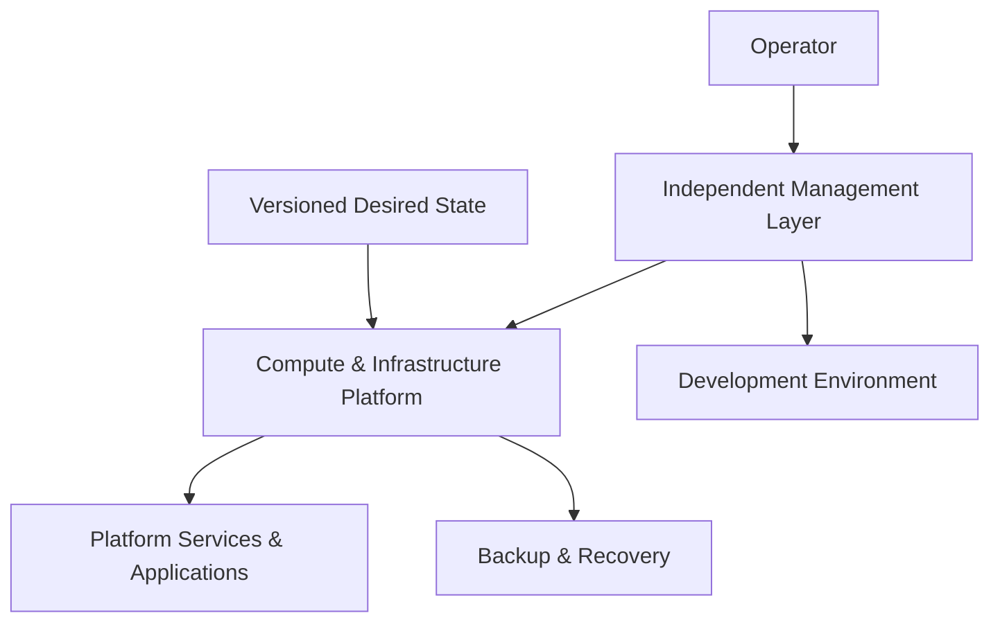

# Network Spelunker

Reproducible infrastructure and homelab engineering focused on declarative operations, recoverability, failure isolation, and repeatable environments.

## What Network Spelunker Is

Network Spelunker is a hands-on infrastructure engineering ecosystem for designing and operating a small production-oriented homelab without confusing logical separation with physical high availability.

The project treats infrastructure as a reproducible system: durable desired state is versioned, platform changes are reviewed, recovery responsibilities are separated from workloads, and runtime readiness requires evidence rather than configuration alone.

## The Problem

A homelab can become difficult to recover when configuration exists only on individual machines, management depends on the same platform being managed, backups share the same failure domain, or operational knowledge survives only as one-off manual procedures.

Network Spelunker addresses those problems by making infrastructure state, responsibilities, recovery assumptions, and validation boundaries explicit and repeatable.

## The Approach

The ecosystem separates management, infrastructure, applications, development, and recovery responsibilities so that each can evolve without becoming the only way to restore the others.

Declarative configuration and GitOps are used where they improve reproducibility, while runtime validation remains separate from source-level validation.

## Core Capabilities

- Declarative infrastructure and desired-state management.
- GitOps-driven reconciliation for container orchestration.
- Independent management and recovery responsibilities.
- Failure-domain-aware storage and backup planning.
- Reproducible development and administration environments.
- Repository-local validation paired with runtime readiness checks.
- Recovery-oriented documentation and explicit operational boundaries.

## Example Use Cases

- Rebuild infrastructure from reviewed configuration after a host or platform failure.
- Reconcile platform services from version-controlled desired state.
- Administer degraded infrastructure through an independent management layer.
- Separate development tooling from production recovery responsibilities.
- Validate backups and recovery procedures without treating a successful backup job as proof of recoverability.
- Evolve a homelab using documentation, review, automation, and failure-domain disciplines commonly applied to production infrastructure.

## High-Level Architecture

This is a **Conceptual Architecture**. It communicates engineering responsibilities without exposing the internal deployment topology, exact access paths, recovery entrypoints, node layout, service routing, or other operational details.

## Engineering Principles

### Recovery must not depend on the workload platform

Management and recovery responsibilities are separated from the systems they are expected to repair so a platform outage does not automatically remove the primary recovery path.

### Desired state should be reconstructable

Durable infrastructure configuration belongs in version control and should be capable of rebuilding the intended state without relying on undocumented manual changes.

### Failure domains must be explicit

Logical isolation is not presented as physical redundancy. Storage, backup, and recovery decisions are evaluated against the failure domains that actually exist.

### Validation and runtime evidence are different

Passing repository checks proves that source-level expectations are satisfied. It does not prove that physical hosts, networks, orchestration, storage, backups, or restores are operational.

### Durable knowledge and execution state are separate

Architecture and operating contracts remain in durable documentation. Temporary blockers, assignments, migrations, and implementation checkpoints belong in project tracking rather than permanent architecture documents.

## Technologies & Engineering Areas

Network Spelunker demonstrates work across areas including:

- Kubernetes and container orchestration;
- Talos Linux;
- GitOps and Flux;
- infrastructure as code and declarative configuration;
- virtualization and platform engineering;
- networking and service exposure;
- persistent storage and backup design;
- CI/CD and automated validation;
- Linux systems administration;
- recovery planning and failure-domain analysis.

Technology names are included to communicate engineering breadth. Operational versions, exact routing, internal service combinations, private access mechanisms, and sensitive deployment details are intentionally omitted from the public product surface.

## Projects

Network Spelunker is organized around focused infrastructure responsibilities, including:

- a declarative Kubernetes platform;
- an independent management and recovery environment;
- a reproducible remote development environment;
- shared engineering governance and validation conventions.

The implementation repositories are intentionally private. This public organization profile explains the engineering problems, system responsibilities, and design philosophy without exposing their operational topology.
